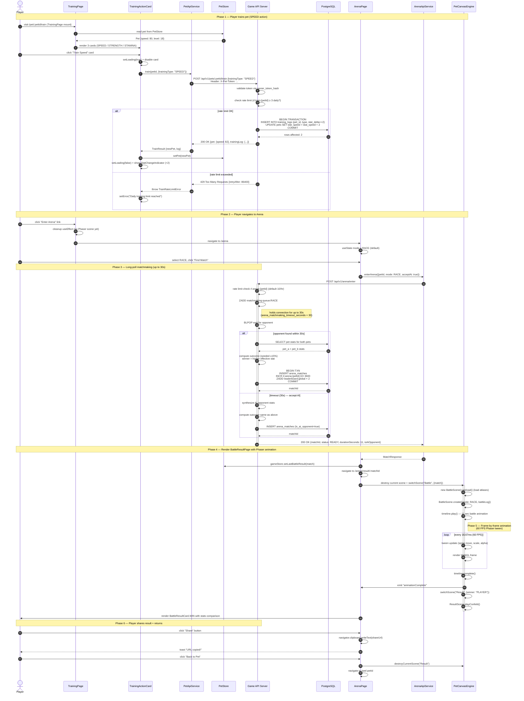

# Frontend Sequence — Main Game Interaction (Train + Enter Arena + Battle Result)

> 來源：docs/FRONTEND.md §5.3 Training Interaction + §5.5 Arena Battle Flow + docs/API.md §5.2 / §5.3

描述玩家完成「訓練 → 進場 → 看結果」一個完整的核心遊戲循環，覆蓋多個 component、多個 store 與多個 API 呼叫。

## 涵蓋的完整流程

| Phase | UI 元件 | API 呼叫 | Store 變動 | Phaser 場景 |
|-------|--------|---------|-----------|------------|
| 1 訓練 | TrainingPage / TrainingActionCard | POST /pets/:id/train | PetStore.setPet | (none) |
| 2 導航 | TrainingPage → ArenaPage | (none) | (none) | (none) |
| 3 媒合 | ArenaPage / MatchmakingStatus | POST /arena/enter (long-poll 30s) | (none) | (none) |
| 4 切場景 | ArenaPage → BattleResultPage | (none) | GameStore.setLastBattleResult | destroy idle, switch to Battle |
| 5 動畫 | BattleAnimation | (none) | (none) | BattleScene.timeline.play (11s) |
| 6 結束 | BattleResultPage / Share | (none) | (none) | switch to Result, then back to Idle |

## Async Operation Awaits

- Phase 1: `await PetSvc.train(...)` (~150ms typical) blocks UI with disabled card
- Phase 3: `await ArenaSvc.enterArena(...)` (long-poll 0~30s) blocks ArenaPage with MatchmakingStatus spinner
- Phase 5: Phaser tween timeline runs in background; React continues to be responsive

## Error Branches Covered

- Phase 1: 429 rate limit (TrainRateLimitError) → show daily-limit toast
- Phase 3 (not shown but exists): 429 arena rate-limit, 408 matchmaking timeout (acceptAi=false)
- Phase 5 (not shown): if Phaser fails to load asset → fallback to text-only result card
