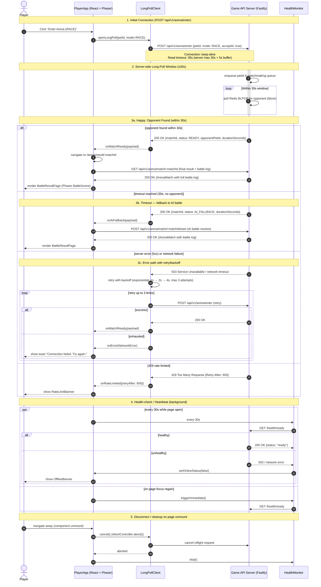

# Frontend Sequence — HTTP Long-Polling Protocol

> 來源：docs/FRONTEND.md §2.6 API Client + docs/API.md §5.3 Arena Endpoints

> **注意**：本系統採 HTTP Long-Polling 取代 WebSocket（API.md §5.3 Scope note）。
> 本圖描述客戶端與伺服器的「持續連線」訊息協議，包括：建立連線、心跳、超時退避、斷線重連。

## Notes

- **No actual WebSocket**：API.md §5.3 明確指出 MVP 用 HTTP long-polling，避免持久化 WebSocket server 的運營複雜度。
- **Read timeout 35s**：客戶端 `AbortController` 設 35 秒，比伺服器 30 秒 long-poll 窗口多 5 秒緩衝。
- **Retry budget**：失敗時最多 3 次 exponential backoff（1s / 2s / 4s）；total 最多 ~7 秒等待後才告知使用者失敗。
- **Heartbeat / health check**：每 30 秒呼叫一次 `/health/ready`，並在 `window.onfocus` 立即觸發。
- **Cancel on unmount**：React `useEffect` cleanup function 呼叫 `AbortController.abort()` 取消 inflight 請求，防止 memory leak。

## 訊息類型清單

| Event | Direction | Payload Schema |
|-------|-----------|---------------|
| `enter_arena_request` | Client → Server | `{petId: UUID, mode: ArenaMode, acceptAi: Boolean}` |
| `match_ready` | Server → Client | `{matchId: UUID, status: "READY", opponentPetId: UUID, durationSeconds: Integer}` |
| `ai_fallback` | Server → Client | `{matchId: UUID, status: "AI_FALLBACK", durationSeconds: Integer}` |
| `rate_limited` | Server → Client | `{error: "RATE_LIMITED", retryAfter: Integer}` |
| `health_check` | Client → Server | `GET /health/ready` (no body) |
| `health_response` | Server → Client | `{status: "ready" \| "degraded"}` |
