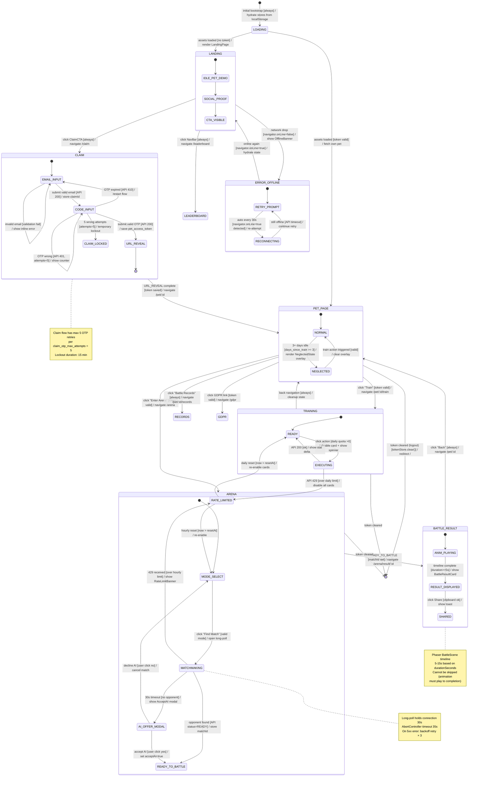

# Frontend State Machine — Scene Lifecycle

> 來源：docs/FRONTEND.md §2.5 React Router v6 + §5 Key UI Flows

描述 Player App 客戶端的「scene 狀態機」：從首頁到認領、養成、競技、結算、登出 / 錯誤恢復的完整生命週期。

## State 對應 UI Surfaces

| State | UI Surface | Phaser Scene |
|-------|-----------|--------------|
| LOADING | App.tsx initial spinner | (none) |
| LANDING | LandingPage | IdlePet (demo random pet) |
| CLAIM | ClaimPage 3-step compound | (none — no Phaser on claim) |
| PET_PAGE | PetPage | IdlePet (own pet) |
| TRAINING | TrainingPage | (light Phaser animation) |
| ARENA | ArenaPage | (none — pre-battle) |
| BATTLE_RESULT | BattleResultPage | Battle → Result |
| ERROR_OFFLINE | OfflineBanner overlay | (frozen current scene) |

## Transition Triggers / Guards

每個 transition 包含 `trigger [guard] / action`：

- `trigger`：使用者操作或系統事件（click, navigate, timeout, networkStatus）
- `[guard]`：判定條件（token valid?, daily quota?, mode valid?, online?）
- `action`：副作用（store update, navigate, show toast, fire animation）

## Notes

- 所有 state 在 token 失效時都可轉至 `[*]`（logout 終態）
- ERROR_OFFLINE 是橫切 state，從任何 state 進入並回到原 state
- Phaser scene 生命週期由 `PetCanvasEngine.switchScene` 自動管理，不在 React state 中追蹤
