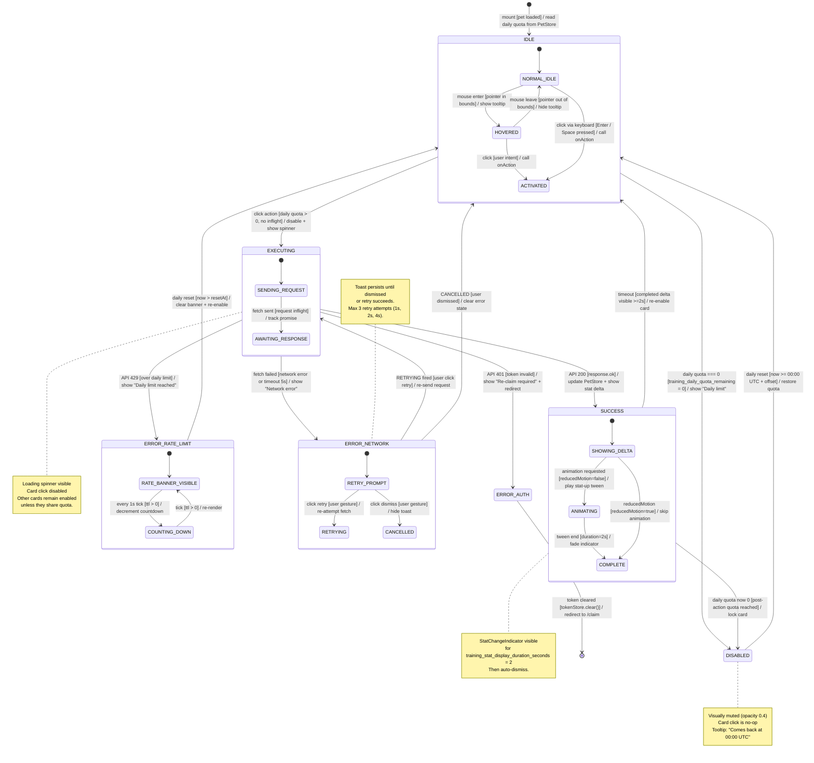

# Frontend State Machine — TrainingActionCard UI

> 來源：docs/FRONTEND.md §5.3 Training Interaction + docs/VDD.md §UI States

描述「TrainingActionCard」這個關鍵互動 UI 元件的所有狀態與轉換。
此元件決定玩家是否可訓練、訓練是否成功、是否觸發冷卻。

## State 對應 UI 變化

| State | Visual | Aria Label | Click Behavior |
|-------|--------|-----------|----------------|
| IDLE.NORMAL_IDLE | full opacity, hover tint | `aria-label="Train Speed"` | enabled |
| IDLE.HOVERED | scale 1.05 + tooltip | (same) | enabled |
| EXECUTING | spinner overlay | `aria-busy="true"` | disabled |
| SUCCESS.ANIMATING | green +2 bubble tween up | `aria-live="polite" Speed +2` | (no-op) |
| SUCCESS.COMPLETE | full opacity + delta gone | (same) | enabled |
| ERROR_RATE_LIMIT | red badge + countdown | `aria-live="assertive"` | disabled |
| ERROR_NETWORK | toast notification | (toast a11y) | enabled (retry) |
| ERROR_AUTH | redirect imminent | `aria-live="assertive"` | (no-op) |
| DISABLED | grey 0.4 opacity | `aria-disabled="true"` | (no-op) |

## Triggers Reference

| Trigger | Source | Frequency |
|---------|--------|-----------|
| `click` | user mouse / touch | once per gesture |
| `keyboard` | Enter/Space on focused card | once per gesture |
| `mouse enter / leave` | pointer event | continuous while present |
| `fetch sent` | TanStack Query useMutation | per attempt |
| `API 200/4xx/5xx` | server response | once per attempt |
| `tween end` | Phaser tween onComplete | per animation |
| `daily reset` | system (clock + interval) | once per day |
| `tick` | setInterval 1s | continuous during ERROR_RATE_LIMIT |

## Notes

- 所有 transition label 使用 `trigger [guard] / action` 格式（無 ` ` 違規）
- `DISABLED` 與 `ERROR_RATE_LIMIT` 視覺類似但語意不同：DISABLED 是預期狀態（每日重置），RATE_LIMIT 是 hard error
- Reduced motion preference 影響 SUCCESS 子狀態流（跳過 ANIMATING）
- 所有 ERROR_* 狀態都可從 IDLE 重新進入，這是 React idempotent 設計的好處
