# Frontend Use Case Diagram — pixel-pet-arena Player App

> 來源：docs/FRONTEND.md §2 Player App + docs/PDD.md §UI flows + docs/PRD.md §3 User Stories

涵蓋玩家在 React 18 + Phaser.js Player App 上可執行的所有用例，依四大角色（Guest / Owner / Competitor / Collector）分組。

```mermaid
flowchart TD
    Guest["Guest Player<br/>訪客（無 token）"]
    Owner["Pet Owner<br/>已認領玩家（持 32-byte token）"]
    Competitor["Competitor<br/>競技玩家（已訓練）"]
    Collector["Collector<br/>收藏者（關注稀有度）"]
    Engine["Engine System<br/>(Phaser.js / React Router /<br/>Service Worker)"]

    subgraph ClientApp ["Player App — React 18 + Phaser.js 3 + Vite 5"]

        subgraph Anonymous ["Guest Surfaces (no token)"]
            UF1["((UC-F-01: ViewLandingPage<br/>看到隨機寵物 + Claim CTA))"]
            UF2["((UC-F-02: ClickPetCanvas<br/>觸發 Phaser interactive idle))"]
            UF3["((UC-F-03: NavigateToClaim<br/>進入 /claim 表單))"]
            UF4["((UC-F-04: ViewLeaderboardPublic<br/>查看 Top 100 公開榜))"]
            UF5["((UC-F-05: ViewBattleRecordPublic<br/>瀏覽公開對戰記錄分享 URL))"]
        end

        subgraph OwnerCore ["Owner Core (with pet_access_token)"]
            UF6["((UC-F-06: VerifyOTPAndStoreToken<br/>3-step claim flow + localStorage))"]
            UF7["((UC-F-07: AccessOwnPet<br/>從 bookmark / token URL 進入))"]
            UF8["((UC-F-08: TrainPetThreeActions<br/>每日 3 次訓練動作))"]
            UF9["((UC-F-09: FeedPet<br/>使用 food buff 提升 stat))"]
            UF10["((UC-F-10: RecoverLostURL<br/>email 重新驗證取回 token))"]
            UF11["((UC-F-11: SubmitGdprErasure<br/>提出 GDPR 刪除請求))"]
        end

        subgraph CompetitorPath ["Competitor Path"]
            UF12["((UC-F-12: SelectArenaMode<br/>選擇 RACE / SUMO))"]
            UF13["((UC-F-13: EnterMatchmakingPolling<br/>30秒 long-poll 等對手))"]
            UF14["((UC-F-14: AcceptAIBattle<br/>媒合超時時接受 AI))"]
            UF15["((UC-F-15: WatchPhaserBattleAnim<br/>看 5-15 秒 Phaser 動畫))"]
            UF16["((UC-F-16: ViewBattleResult<br/>看 WIN/LOSS BattleResultCard))"]
            UF17["((UC-F-17: ShareBattleResult<br/>分享 result URL 到社群))"]
            UF18["((UC-F-18: ViewBattleHistory<br/>看 last 20 對戰記錄))"]
        end

        subgraph CollectorPath ["Collector Path"]
            UF19["((UC-F-19: BrowseRarityShowcase<br/>瀏覽稀有度展示頁))"]
            UF20["((UC-F-20: ViewRarityHint<br/>landing 上的 Rarity Badge))"]
            UF21["((UC-F-21: ListMarketplacePet<br/>FF_MARKETPLACE — 上架))"]
        end

        subgraph EngineSystemUseCases ["Client Engine Internal"]
            UF22["((UC-F-22: PreloadSpriteAtlases<br/>預先載入 Phaser 圖集))"]
            UF23["((UC-F-23: HandleOfflineFallback<br/>Service Worker 離線提示))"]
            UF24["((UC-F-24: ApplyReducedMotion<br/>respect prefers-reduced-motion))"]
        end
    end

    Guest -- 直接使用 --> UF1
    Guest -- 直接使用 --> UF2
    Guest -- 直接使用 --> UF3
    Guest -- 直接使用 --> UF4
    Guest -- 直接使用 --> UF5
    Guest -- "&lt;&lt;extend&gt;&gt;" --> UF6

    Owner -- 直接使用 --> UF6
    Owner -- 直接使用 --> UF7
    Owner -- 直接使用 --> UF8
    Owner -- 直接使用 --> UF9
    Owner -- 直接使用 --> UF10
    Owner -- 直接使用 --> UF11
    Owner -- "&lt;&lt;extend&gt;&gt;" --> UF12

    Competitor -- 直接使用 --> UF12
    Competitor -- 直接使用 --> UF13
    Competitor -- 直接使用 --> UF14
    Competitor -- 直接使用 --> UF15
    Competitor -- 直接使用 --> UF16
    Competitor -- 直接使用 --> UF17
    Competitor -- 直接使用 --> UF18
    Competitor -- "&lt;&lt;include&gt;&gt;" --> UF8

    Collector -- 直接使用 --> UF1
    Collector -- 直接使用 --> UF19
    Collector -- 直接使用 --> UF20
    Collector -- 直接使用 --> UF21
    Collector -- "&lt;&lt;extend&gt;&gt;" --> UF6

    Engine -- 直接使用 --> UF22
    Engine -- 直接使用 --> UF23
    Engine -- 直接使用 --> UF24

    UF6 -- "&lt;&lt;include&gt;&gt;" --> UF7
    UF7 -- "&lt;&lt;include&gt;&gt;" --> UF22
    UF12 -- "&lt;&lt;include&gt;&gt;" --> UF13
    UF13 -- "&lt;&lt;extend&gt;&gt;" --> UF14
    UF15 -- "&lt;&lt;include&gt;&gt;" --> UF24
```

## Actor 對應

| Actor | 中文名 | 主要 Use Cases | 認證需求 |
|-------|-------|---------------|---------|
| Guest Player | 訪客 | UF-01..05 + extends → UF-06 | 無 token |
| Pet Owner | 寵物擁有者 | UF-06..11 | 32-byte pet_access_token |
| Competitor | 競技玩家 | UF-12..18 | pet_access_token |
| Collector | 收藏者 | UF-19..21 | 取決於是否要購買 |
| Engine System | 客戶端引擎 | UF-22..24 | 純客戶端 |

## 關係類型

- 直接使用：Actor → UC（使用者主動觸發）
- `<<include>>`：UC 強制包含子 UC（總是會發生）
- `<<extend>>`：UC 擴展另一個 UC（條件性觸發）

## Use Case 與 PRD AC 的對應

| Frontend UC | PRD AC |
|-------------|--------|
| UF-06 VerifyOTPAndStoreToken | AC-CLAIM-001 + AC-CLAIM-002 |
| UF-08 TrainPetThreeActions | AC-PET-TRAIN-001 |
| UF-13 EnterMatchmakingPolling | AC-ARENA-MATCHMAKING-001 |
| UF-15 WatchPhaserBattleAnim | AC-VDD-BATTLE-ANIM-001 |
| UF-24 ApplyReducedMotion | AC-A11Y-MOTION-001 |
