# Local Infrastructure Topology — pixel-pet-arena

> 來源：docs/CICD.md §4 ArgoCD + §6 Secrets Management + docs/LOCAL_DEPLOY.md namespaces

描述 Rancher Desktop k3s 上的本地完整環境拓撲，跨 `dev-tools` / `argocd` / `pet-staging-local` / `pet-production-local` 命名空間。

```mermaid
graph TB
    subgraph RD["Rancher Desktop k3s (local)"]
        subgraph DevTools["namespace: dev-tools"]
            DetectSec["detect-secrets v1.5.0<br/>(pre-commit hook)<br/>HostPath: /workspace"]
            Lefthook["Lefthook v1.7.x<br/>(git hooks dispatcher)"]
        end

        subgraph ArgoNS["namespace: argocd"]
            ArgoServer["ArgoCD Server v2.11.3<br/>(Service: argocd-server :443)"]
            ArgoRepo["argocd-repo-server<br/>(manifest renderer)"]
            ArgoApp["argocd-application-controller<br/>(reconciliation loop, 3min)"]
        end

        subgraph StagingNS["namespace: pet-staging-local"]
            APIStaging["api Deployment<br/>image: ghcr.io/owner/api:sha-XXXXXXX<br/>replicas: 2 (HPA 2-10)<br/>Port: 3000"]
            PlayerStaging["player-app Deployment<br/>image: ghcr.io/owner/player-app:sha<br/>replicas: 2<br/>Port: 80 (nginx static)"]
            AdminStaging["admin-app Deployment<br/>image: ghcr.io/owner/admin-app:sha<br/>replicas: 1<br/>Port: 80"]
            PGStaging[("postgres-staging<br/>StatefulSet, Postgres 16<br/>PVC: 20Gi local-path<br/>Port: 5432")]
            RedisStaging[("redis-staging<br/>Deployment, Redis 7.2<br/>Port: 6379")]
            IngressStaging["nginx Ingress<br/>host: staging.pet.local<br/>Port: 80/443 (TLS via cert-manager)"]
            SecretsStaging["k8s Secrets<br/>(app-secrets-staging,<br/>db-credentials,<br/>sendgrid-api-key)"]
        end

        subgraph ProdNS["namespace: pet-production-local"]
            APIProd["api Deployment<br/>image: ghcr.io/owner/api:v1.x.x<br/>replicas: 3 (HPA 3-20)<br/>Port: 3000"]
            PlayerProd["player-app Deployment<br/>image: ghcr.io/owner/player-app:v1.x.x<br/>replicas: 3<br/>Port: 80"]
            AdminProd["admin-app Deployment<br/>image: ghcr.io/owner/admin-app:v1.x.x<br/>replicas: 2<br/>Port: 80"]
            PGProd[("postgres-prod<br/>StatefulSet, Postgres 16 (Primary+Replica)<br/>PVC: 100Gi local-path<br/>Port: 5432")]
            RedisProd[("redis-prod<br/>Deployment, Redis 7.2 (Sentinel)<br/>Port: 6379/26379")]
            IngressProd["nginx Ingress<br/>host: pet.local<br/>Port: 80/443 (TLS)"]
            SecretsProd["k8s Secrets<br/>(app-secrets-prod,<br/>db-credentials-prod,<br/>sendgrid-api-key)"]
        end
    end

    subgraph External["External (GitHub-hosted)"]
        GitRepo["GitHub Repo<br/>github.com/owner/pixel-pet-arena<br/>(main + feature branches)"]
        GHA["GitHub Actions<br/>ci.yml + deploy-*.yml runners"]
        GHCR["ghcr.io<br/>Container Registry<br/>(api / player-app / admin-app)"]
        SendGrid["SendGrid REST API<br/>https://api.sendgrid.com/v3"]
    end

    subgraph DevHost["Developer Host (macOS / Linux)"]
        Dev["Developer<br/>git + pnpm + docker"]
        Browser["Browser<br/>Chrome / Firefox / Safari"]
    end

    Dev -->|"git push HTTPS:443"| GitRepo
    GitRepo -->|"webhook POST"| GHA
    GHA -->|"docker push HTTPS:443"| GHCR
    GHA -->|"kustomize edit + git commit"| GitRepo
    ArgoRepo -->|"git fetch HTTPS:443 (poll 3min)"| GitRepo
    ArgoApp -->|"kubectl apply (intra-cluster)"| StagingNS
    ArgoApp -->|"kubectl apply (intra-cluster)"| ProdNS
    StagingNS -->|"docker pull HTTPS:443"| GHCR
    ProdNS -->|"docker pull HTTPS:443"| GHCR

    Browser -->|"HTTPS:443 staging.pet.local"| IngressStaging
    Browser -->|"HTTPS:443 pet.local"| IngressProd
    IngressStaging -->|"HTTP:3000"| APIStaging
    IngressStaging -->|"HTTP:80"| PlayerStaging
    IngressStaging -->|"HTTP:80"| AdminStaging
    IngressProd -->|"HTTP:3000"| APIProd
    IngressProd -->|"HTTP:80"| PlayerProd
    IngressProd -->|"HTTP:80"| AdminProd

    APIStaging -->|"TCP:5432<br/>Postgres Wire Protocol"| PGStaging
    APIStaging -->|"TCP:6379<br/>Redis RESP"| RedisStaging
    APIStaging -.->|"HTTPS:443<br/>SendGrid REST"| SendGrid
    APIProd -->|"TCP:5432"| PGProd
    APIProd -->|"TCP:6379"| RedisProd
    APIProd -.->|"HTTPS:443"| SendGrid

    SecretsStaging -->|"envFrom: secretRef"| APIStaging
    SecretsProd -->|"envFrom: secretRef"| APIProd

    Dev -->|"./scripts/install-hooks.sh"| Lefthook
    Lefthook -->|"pre-commit"| DetectSec

    classDef nsBox fill:#f0f8ff,stroke:#369
    classDef storage fill:#fff4e0,stroke:#963
    classDef external fill:#f8f0ff,stroke:#639
    class StagingNS,ProdNS,DevTools,ArgoNS nsBox
    class PGStaging,PGProd,RedisStaging,RedisProd storage
    class GitRepo,GHA,GHCR,SendGrid external
```

## Key Configuration

| Component | Purpose | Source |
|-----------|---------|--------|
| ArgoCD v2.11.3 | GitOps reconciliation (3-min poll) | CICD.md §4.1 |
| Kustomize overlays | `k8s/staging/` and `k8s/production/` | CICD.md §4.3 |
| postgres-staging | Single instance, persistent volume claim | LOCAL_DEPLOY.md §3 |
| redis-staging | Single Redis 7.2 (no Sentinel for staging) | LOCAL_DEPLOY.md §4 |
| nginx Ingress | Routes by host header to per-app Service | LOCAL_DEPLOY.md §6 |
| cert-manager | Issues self-signed certs for `*.pet.local` | LOCAL_DEPLOY.md §6.2 |

## Notes

- **No external Gitea**: Project uses GitHub directly (CICD.md §1) — Gitea node not deployed.
- **No Jenkins**: GitHub Actions is the canonical CI; Jenkinsfile (CICD.md §8) is provided as alternative for teams that already operate Jenkins.
- **Local DNS**: `staging.pet.local` and `pet.local` resolved via `/etc/hosts` (LOCAL_DEPLOY.md §6.1).
- **Local TLS**: Self-signed certs by cert-manager; trust the root CA in macOS Keychain (LOCAL_DEPLOY.md §6.2).
- **Storage class**: `local-path` (Rancher Desktop default); production volumes are 100Gi for PG primary + replica.
