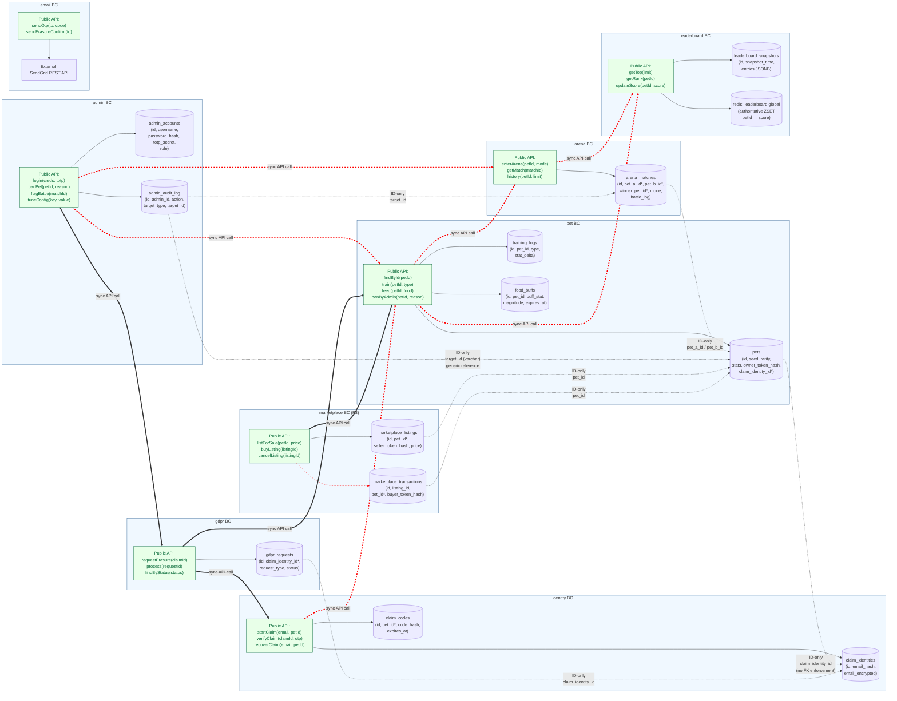

# BC Schema Isolation Diagram — pixel-pet-arena

> 來源：docs/SCHEMA.md table ownership + docs/ARCH.md §2 Component Architecture

每個 Bounded Context 擁有獨立的資料表群組，跨 BC 引用以「ID-only（no FK）」表示，避免直接耦合。
公共 API 介面以綠色實線標注，跨 BC 共用資料只能經 API 取得。



## BC 邊界規則

1. **Schema 擁有權**：每張資料表只屬於一個 BC，由該 BC 的 Repository 獨佔讀寫。
2. **跨 BC 引用**：只允許 ID-only 引用（如 `pet_a_id UUID`），**禁止跨 BC 的外鍵約束**。
3. **跨 BC 取資**：只能經 Public API 呼叫對方 BC 的 Service，不得直接 SELECT 對方資料表。
4. **Domain Event**：跨 BC 的非同步協作透過 Domain Event 廣播，由消費者 BC 訂閱（解耦）。
5. **Phase 3 隔離**：`marketplace` BC 透過 Feature Flag `FF_MARKETPLACE` 控制；未啟用時整個 BC 模組不載入。

## 共享核心常數（Cross-BC）

僅以下類型為共享 Kernel（位於 `packages/shared`）：

- 共用 Enum：`Rarity`、`ArenaMode`、`TrainingType`、`GdprRequestType`、`AdminRole`
- 共用 ValueObject 型別：`UUID`、`DateTime`、`Money`、`TokenHash`
- 共用常數：CONSTANTS.md 的所有 numeric / string 常數（不含 secret）

## 違規偵測

CI 階段透過 `eslint-plugin-import` 規則檢查：

```javascript
// .eslintrc.js
'import/no-restricted-paths': ['error', {
  zones: [
    { target: './packages/identity/**', from: './packages/pet/repositories/**' },
    { target: './packages/pet/**', from: './packages/arena/repositories/**' },
    // ... (deny direct cross-BC repository imports)
  ]
}]
```
