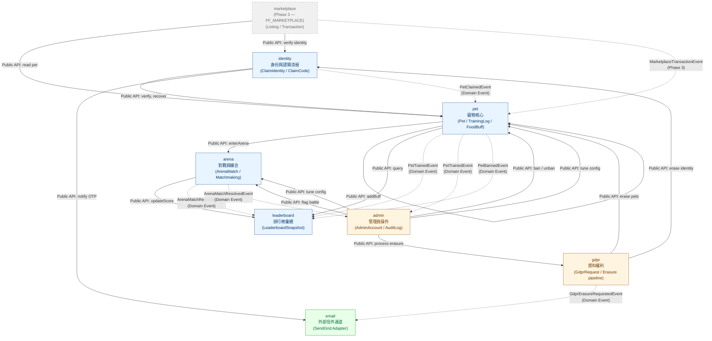

# Spring Modulith Module Dependency DAG — pixel-pet-arena

> 來源：docs/ARCH.md §2 Component Architecture + EDD.md §3 Bounded Contexts

雖然本系統採用 Node.js + Fastify（非 Spring），但 Bounded Context 的依賴關係仍以 Spring Modulith 風格的 DAG 表達，
確保模組間呼叫沒有循環依賴（HC-5 DAG 約束），並區分同步 Public API 與非同步 Domain Event。



## 圖例

- **實線箭頭（→）**：同步 Public API 呼叫（function call / HTTP within monorepo）
- **虛線箭頭（-.->）**：非同步 Domain Event（透過 EventBus 派送）
- **節點顏色**：
  - 藍色 = Core BC（核心領域：Identity / Pet / Arena / Leaderboard）
  - 橘色 = Supporting BC（支援領域：Gdpr / Admin）
  - 綠色 = External BC（外部整合：Email）
  - 灰色虛框 = Phase 3 BC（FF_MARKETPLACE 啟用後生效）

## 依賴方向驗證（DAG 約束）

按 topological sort 排列（無循環依賴）：

```
Identity → Pet → Arena → Leaderboard
        ↘ Email     ↘ Admin → (Pet, Arena, Gdpr)
        ↗ Gdpr      ↗
Marketplace → Pet, Identity (Phase 3 only)
```

✅ 無循環依賴；Identity / Email 為「下游葉節點」，Admin / Marketplace 為「上游觸發者」。

## 模組職責摘要

| Module | Owner BC | 主要 API | 對外 Domain Event |
|--------|---------|---------|------------------|
| `identity` | Identity Auth | `startClaim` / `verifyClaim` / `recoverClaim` | `PetClaimedEvent` |
| `pet` | Pet Core | `train` / `feed` / `getById` / `random` | `PetTrainedEvent`, `PetBannedEvent` |
| `arena` | Arena | `enterArena` / `getMatch` / `history` | `ArenaMatchResolvedEvent` |
| `leaderboard` | Leaderboard | `getTop` / `getRank` / `update` | （消費者） |
| `gdpr` | GDPR | `requestErasure` / `process` | `GdprErasureRequestedEvent` |
| `admin` | Admin | `login` / `ban` / `flag` / `tune` | （消費者 + 觸發者） |
| `email` | Email | `sendOtp` / `sendConfirmation` | （消費者） |
| `marketplace` | Marketplace (P3) | `list` / `buy` / `cancel` | `MarketplaceTransactionEvent` |
