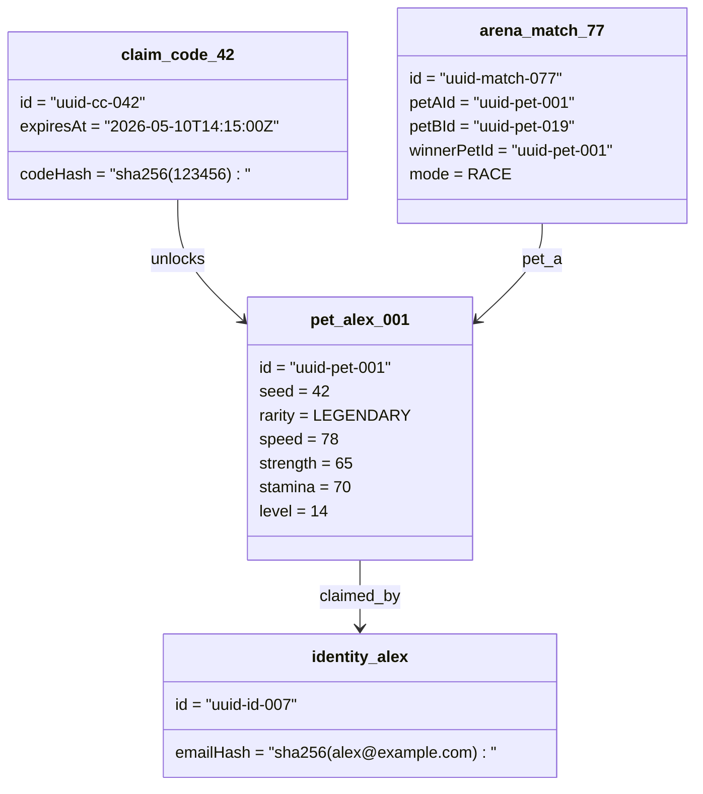

# Object Diagram — Runtime Snapshot

下圖呈現一個典型運行期物件配置：玩家 Alex 領養了 LEGENDARY 等級寵物 `pet_alex_001`，在某次 Race 比賽中（`arena_match_77`）獲勝，且 `claim_code_42` 為其領養所用 OTP 紀錄。

> Snapshot 為某時點實例化結果，輔助理解 Class Diagram 的執行期樣貌。
