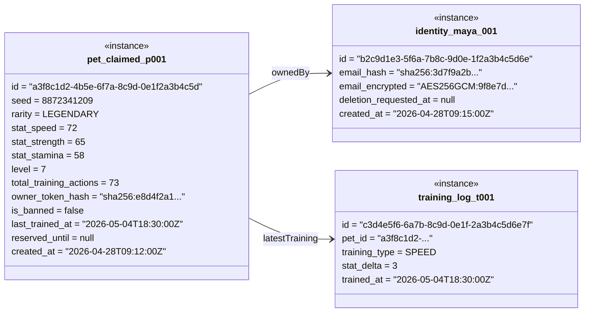
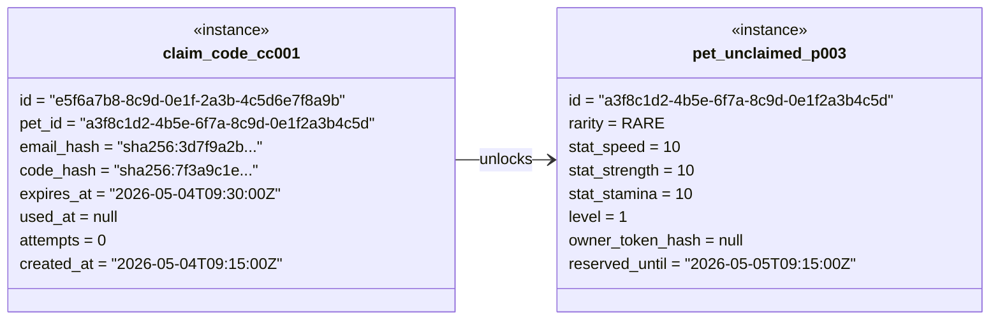

# Object Diagram — pixel-pet-arena

> 來源：EDD §4.1 Pet, §4.2 User, §4.3 ClaimCode, §4.4 ArenaMatch

## Snapshot 1 — Claimed Pet (IDLE state, Level 7)



## Snapshot 2 — Arena Match (RESOLVED state, Race mode)

```mermaid
classDiagram
    direction LR

    class arena_match_m001 {
        <<instance>>
        id = "d4e5f6a7-7b8c-9d0e-1f2a-3b4c5d6e7f8a"
        pet_a_id = "a3f8c1d2-..."
        pet_b_id = "f9e8d7c6-5b4a-3c2d-1e0f-8a7b6c5d4e3f"
        mode = RACE
        winner_pet_id = "a3f8c1d2-..."
        battle_log = "{speed_a:72, speed_b:55, modifier_a:0.08, modifier_b:-0.11, outcome: pet_a_wins}"
        created_at = "2026-05-04T20:00:00Z"
        completed_at = "2026-05-04T20:00:12Z"
        is_flagged = false
    }

    class pet_winner_p001 {
        <<instance>>
        id = "a3f8c1d2-4b5e-6f7a-8c9d-0e1f2a3b4c5d"
        stat_speed = 72
        level = 7
        rarity = LEGENDARY
    }

    class pet_loser_p002 {
        <<instance>>
        id = "f9e8d7c6-5b4a-3c2d-1e0f-8a7b6c5d4e3f"
        stat_speed = 55
        level = 4
        rarity = COMMON
    }

    arena_match_m001 --> pet_winner_p001 : winner
    arena_match_m001 --> pet_loser_p002 : loser
```

## Snapshot 3 — Claim Code (PENDING state, 6-digit OTP)


