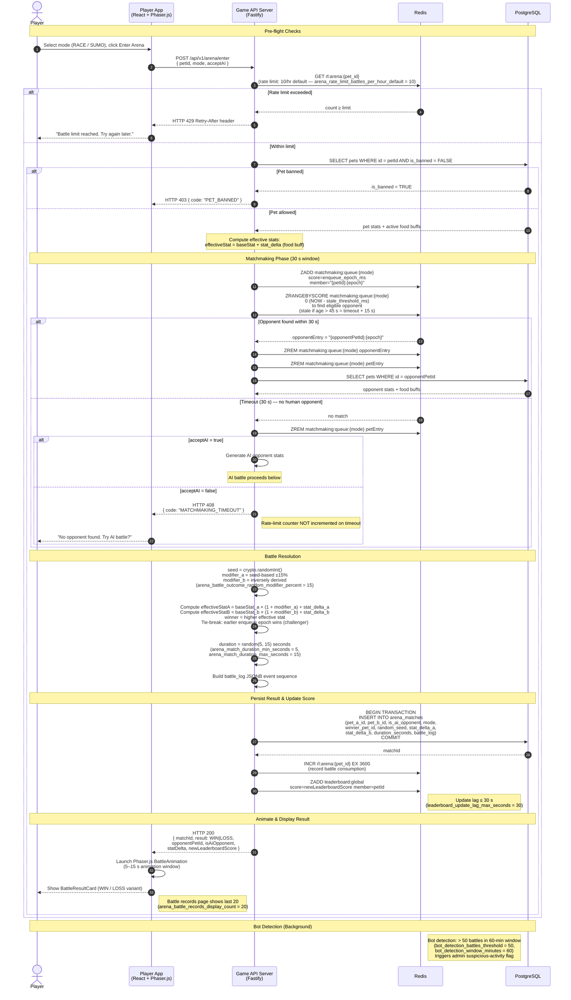

# Sequence Diagram — Arena Battle Matchmaking

## Overview

The arena battle flow handles matchmaking, battle outcome computation, and leaderboard score
updates. Players enter via `POST /api/v1/arena/enter` and the server holds a long-poll (HTTP
long-polling) for up to 30 seconds (`arena_matchmaking_timeout_seconds = 30`) waiting for an
opponent. If no opponent is found and the player accepted AI (`acceptAI: true`), an AI battle is
resolved immediately. The battle outcome uses a seeded random ±15% modifier
(`arena_battle_outcome_random_modifier_percent = 15`) for deterministic replay.

Two modes are supported:
- **RACE** — primary determining stat is `stat_speed`
- **SUMO** — primary determining stat is `stat_strength`

Rate limit: 10 battles/hour per pet by default (`arena_rate_limit_battles_per_hour_default = 10`),
admin-tunable between 1 and 50 (`arena_rate_limit_admin_min = 1`, `arena_rate_limit_admin_max = 50`).

## Diagram

## Notes

- **Stale entry cleanup**: matchmaking queue entries older than ~45 seconds (timeout 30 s +
  buffer 15 s) are silently discarded by the consumer (`arena_matchmaking_timeout_seconds = 30`).
  Entry format: `"{petId}:{enqueue_epoch_ms}"`.
- **Rate limit not incremented on timeout**: If matchmaking times out without finding an opponent,
  the battle counter `rl:arena:{pet_id}` is NOT incremented, so the player does not lose a
  battle slot for a failed queue attempt.
- **AI opponent**: When `acceptAI: true` and no human is found, the AI opponent is synthesized in
  memory; no `pet_b_id` row is written — `is_ai_opponent = TRUE` and `pet_b_id = NULL` in
  `arena_matches`.
- **Leaderboard score formula**: `win_rate × battles_played × level_multiplier` (ARCH P2). The
  Redis sorted set (`leaderboard:global`) is authoritative; PostgreSQL `leaderboard_snapshots` is
  the durable backup, retaining top 500 entries (`leaderboard_snapshot_retention_top_n = 500`).
- **Banned pet leaderboard removal**: When a pet is banned, `ZREM leaderboard:global petId` is
  called within 5 minutes (`leaderboard_ban_reflection_time_minutes = 5`).
