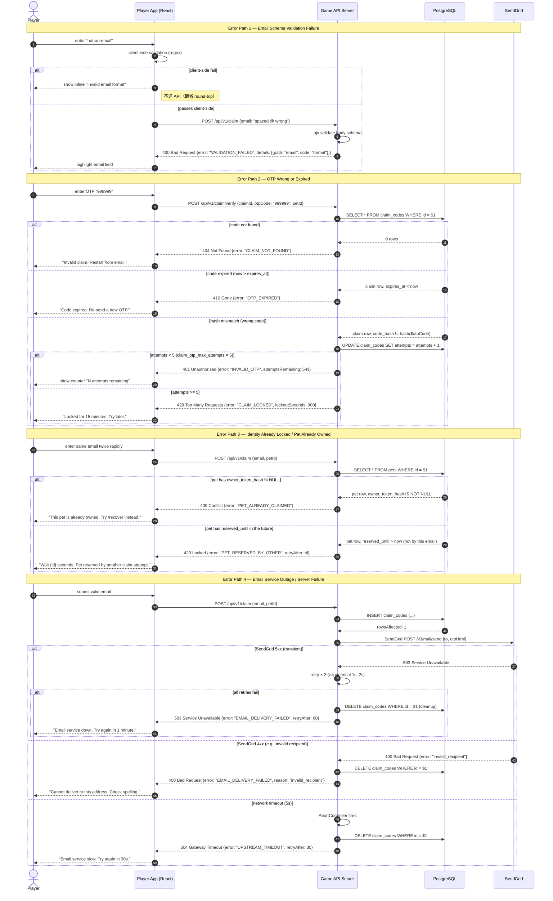

# Sequence Diagram — Claim Flow Error Paths

> 來源：docs/API.md §5.1 Claim Endpoints + §4 Error Code Reference

聚焦 Claim Flow 的 4 條獨立 Error Path：(1) Email schema 違規、(2) OTP wrong/expired、(3) 帳號鎖定、(4) Email service outage。

## Error Path 對應 API.md §4.3 Error Codes

| Path | Error Code | HTTP Status | Recovery Action |
|------|-----------|-------------|----------------|
| 1. Email schema | `VALIDATION_FAILED` | 400 | client-side regex prevention |
| 2a. Code not found | `CLAIM_NOT_FOUND` | 404 | restart claim flow |
| 2b. Code expired | `OTP_EXPIRED` | 410 | re-send OTP |
| 2c. Wrong OTP < 5 attempts | `INVALID_OTP` | 401 | retry input |
| 2d. Wrong OTP ≥ 5 attempts | `CLAIM_LOCKED` | 429 | wait 15 min |
| 3a. Pet already claimed | `PET_ALREADY_CLAIMED` | 409 | use /recover |
| 3b. Pet reserved | `PET_RESERVED_BY_OTHER` | 423 | wait TTL |
| 4a. SendGrid 5xx | `EMAIL_DELIVERY_FAILED` | 503 | retry 1 min |
| 4b. SendGrid 4xx | `EMAIL_DELIVERY_FAILED` | 400 | check email |
| 4c. Network timeout | `UPSTREAM_TIMEOUT` | 504 | retry 30s |

## Notes

- Email service outage path（4）會回滾 DB 中的 claim_code（避免「OTP 已寄出但用戶從未收到」造成髒資料）
- 帳號鎖定路徑（2d）使用 exponential backoff（首次 15 min，第二次 30 min...）
- 所有 error response 統一用 API.md §4.1 error envelope `{error: {code, message, details, traceId}}`
