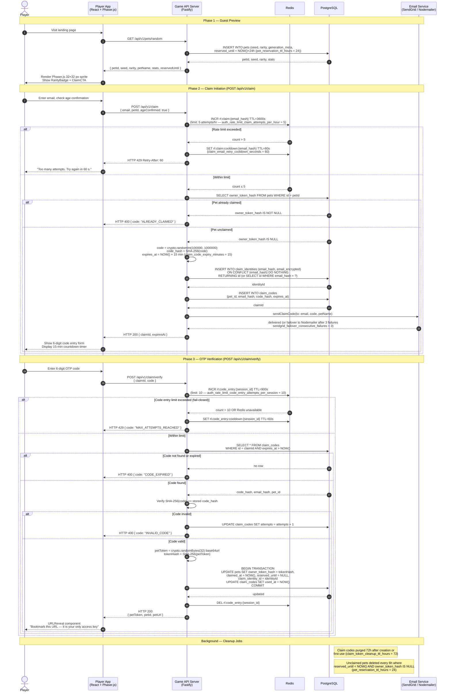

# Sequence Diagram — Pet Claim Email OTP Flow

## Overview

The claim flow is the identity foundation of pixel-pet-arena. Because there are no traditional user
accounts, a 6-digit email OTP (`claim_code_digits = 6`) is the only mechanism by which a player
takes ownership of a pet. On successful verification the server issues a 32-byte URL-safe Base64
token (`pet_access_token_min_bytes = 32`) that becomes the player's permanent credential — stored
only as a SHA-256 hash in `pets.owner_token_hash`. The raw token is transmitted exactly once and
must be bookmarked by the player.

This diagram covers:
1. Guest arrives and gets a random pet displayed (GET /api/v1/pets/random).
2. Player initiates the claim (POST /api/v1/claim).
3. Player enters the OTP (POST /api/v1/claim/verify).
4. Token recovery via POST /api/v1/claim/recover follows the same verify path.

## Diagram

## Notes

- **Fail-closed on Redis unavailability**: OTP code entry (`rl:code_entry:{session_id}`) is
  fail-closed — if Redis is unreachable, the verify endpoint returns HTTP 429 rather than allowing
  brute-force bypass (ARCH P5).
- **Anti-enumeration**: `POST /api/v1/claim/recover` always returns HTTP 200 with a `claimId`
  regardless of whether the email/petId match, preventing email enumeration. The `claimId` is
  functional only when the combination matches a claimed pet.
- **Token transmission**: `petToken` is transmitted exactly once in the HTTP 200 response body.
  The server stores only `SHA-256(petToken)` in `pets.owner_token_hash`. A lost token requires
  the recovery flow.
- **Email OTP expiry warning**: The UI displays an accessibility warning at 2 minutes remaining
  (`a11y_claim_code_warning_before_expiry_minutes = 2`) using an `aria-live` region.
- **GDPR**: Raw email is never written to the database. Only `email_hash` (SHA-256 of lowercased
  email) and `email_encrypted` (AES-256-GCM) are persisted in `claim_identities`.
