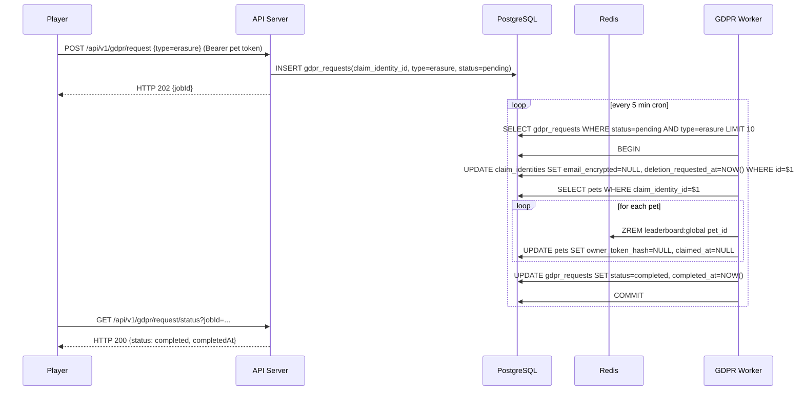

# Sequence Diagram — GDPR Erasure

Owner 提交抹除申請後，API 寫入 `gdpr_requests` 為 pending；GDPR Worker 每 5 分鐘輪詢，將 `claim_identities.email_encrypted` 設為 NULL、移除排行榜分數、寫回 `pets.owner_token_hash=NULL`，最後將 request 標記為 completed。

> SLA：7 天內完成（GDPR Art. 17）；email_encrypted 改為 NULL 即視為「不可逆抹除」，hash 仍保留以避免同 email 再次領養衝突。
