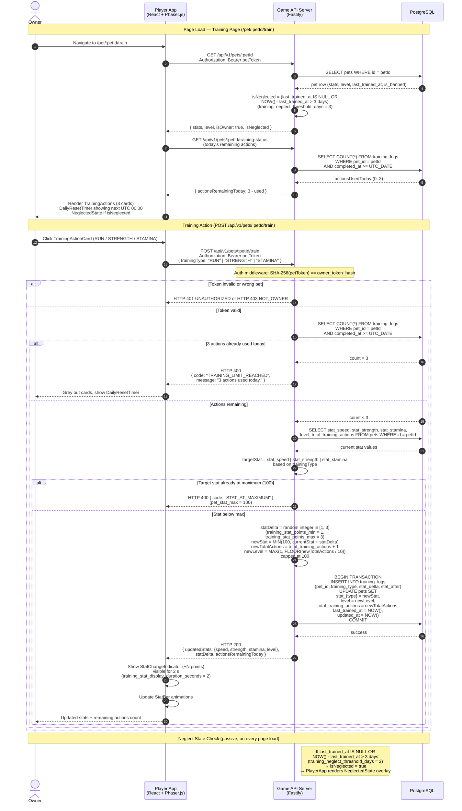

# Sequence Diagram — Pet Training

## Overview

Training is the core progression loop: a pet owner spends up to 3 daily actions
(`training_actions_per_day = 3`, reset at UTC 00:00) to improve one of three stats. Each action
raises the targeted stat by a uniformly random 1–3 points (`training_stat_points_min = 1`,
`training_stat_points_max = 3`) and increments `total_training_actions`, which feeds the level
formula: `level = MAX(1, FLOOR(total_training_actions / 10))` capped at 100
(`pet_level_formula_divisor = 10`, `pet_level_max = 100`).

Three training types map to three stats:
- **RUN** → `stat_speed`
- **STRENGTH** → `stat_strength`
- **STAMINA** → `stat_stamina`

A pet that has not been trained for more than 3 days enters a visual "neglect" state
(`training_neglect_threshold_days = 3`), shown via the `NeglectedState` component.

## Diagram

## Notes

- **Daily action reset**: The 3-action quota is computed by counting `training_logs` rows for
  the current UTC calendar day (`completed_at >= CURRENT_DATE AT TIME ZONE 'UTC'`). The reset
  therefore occurs at UTC 00:00 — not rolling 24 hours from the last action.
- **Level derivation**: `level = MAX(pet_level_default, FLOOR(total_training_actions / pet_level_formula_divisor))`
  where `pet_level_default = 1` and `pet_level_formula_divisor = 10`. At 0 training actions
  the formula yields 0, so the lower bound clamps it to 1. The column is denormalized on `pets`
  for query efficiency and updated atomically inside the same training transaction.
- **Stat ceiling**: If `currentStat + statDelta` would exceed 100 (`pet_stat_max = 100`) the
  value is clamped to 100 and the endpoint returns HTTP 400 `STAT_AT_MAXIMUM` to signal to the
  UI that this stat type is maxed out.
- **Neglect visual**: The `NeglectedState` component appears on the PetPage and TrainingPage
  when `isNeglected = true`. It does not block training — a neglected pet can still train.
- **Food buff interaction**: Active `food_buffs` rows contribute `stat_delta` only during arena
  matches (applied to `arena_matches.stat_delta_a / stat_delta_b`). They do not modify training
  stat gains.
