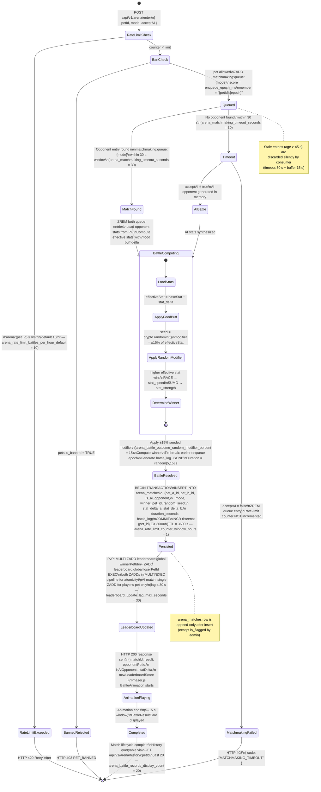

# State Machine — Arena Match

> 來源：docs/EDD.md §3.8 Battle Match State Machine + §4.4 ArenaMatch entity

## Overview

An arena match progresses through a well-defined lifecycle: from queue entry through matchmaking,
battle resolution, result persistence, and leaderboard update. This state machine covers both
human-vs-human (PvP) and human-vs-AI (PvE) paths.

Key timing constants:
- Matchmaking timeout: 30 seconds (`arena_matchmaking_timeout_seconds = 30`)
- Battle animation window: 5–15 seconds (`arena_match_duration_min_seconds = 5`,
  `arena_match_duration_max_seconds = 15`)
- Rate limit: 10 battles/hour default (`arena_rate_limit_battles_per_hour_default = 10`)
- Leaderboard update lag: ≤ 30 seconds (`leaderboard_update_lag_max_seconds = 30`)

## Diagram

## Match States Reference

| State | Description | Redis Keys Active |
|---|---|---|
| Queued | Pet waiting for opponent | `matchmaking:queue:{mode}` entry present |
| MatchFound | Opponent paired; both entries dequeued | — |
| Timeout | No opponent within 30 s (`arena_matchmaking_timeout_seconds = 30`) | — |
| AIBattle | AI opponent path | — |
| BattleComputing | Outcome calculation in memory | — |
| BattleResolved | Winner determined, log built | — |
| Persisted | `arena_matches` row inserted; rate counter incremented | `rl:arena:{pet_id}` incremented |
| LeaderboardUpdated | PvP: both winner and loser Redis sorted set entries updated via MULTI/EXEC; AI: player's pet only | `leaderboard:global` updated (1 or 2 entries) |
| AnimationPlaying | Client animating battle | — |
| Completed | Result shown; history updated | — |

## Notes

- **Random seed reproducibility**: `random_seed` in `arena_matches` is the seed used for the
  ±15% modifier, enabling deterministic replay of any battle via `GET /api/v1/arena/match/:matchId`.
  The `battle_log` JSONB field provides the structured event sequence for the client-side
  Phaser.js replay.
- **Admin flag/unflag**: After a match is in `Completed` state, admin moderators can set
  `is_flagged = TRUE` via `POST /admin/api/battles/:matchId/flag`. This is the only allowed
  mutation to a completed match row. The `flagged_at` timestamp is written atomically with
  `is_flagged`.
- **Bot detection**: A background monitor checks for > 50 battles in a 60-minute rolling window
  (`bot_detection_battles_threshold = 50`, `bot_detection_window_minutes = 60`). Triggered pets
  appear in the admin suspicious-activity view (distinct from `leaderboard_admin_suspicious_flag_battles_per_hour = 50`).
- **AI opponent persistence**: When `is_ai_opponent = TRUE`, `pet_b_id = NULL` in the match row
  and `winner_pet_id` is NULL if the AI wins (the player's pet lost). For human-vs-human,
  `winner_pet_id` is always non-null (tie-break prevents draws).
