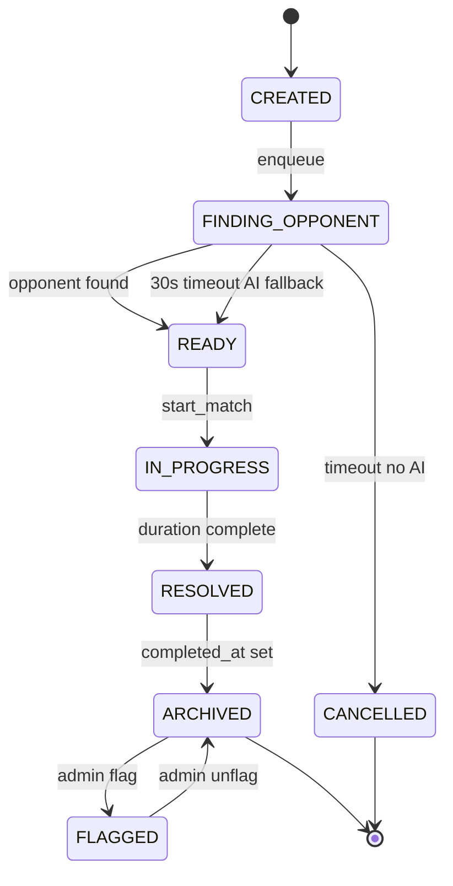

# State Machine Diagram — Arena Match

ArenaMatch entity 從 CREATED → FINDING_OPPONENT（最多 30 秒）→ READY → IN_PROGRESS → RESOLVED → ARCHIVED；超時無 AI fallback 則進入 CANCELLED；ARCHIVED 後可由 Admin 設為 FLAGGED 並還原。

> FLAGGED 狀態用於 Admin 將疑似不公或外掛比賽標註，但不刪除原始 record，以保留 audit trail。
