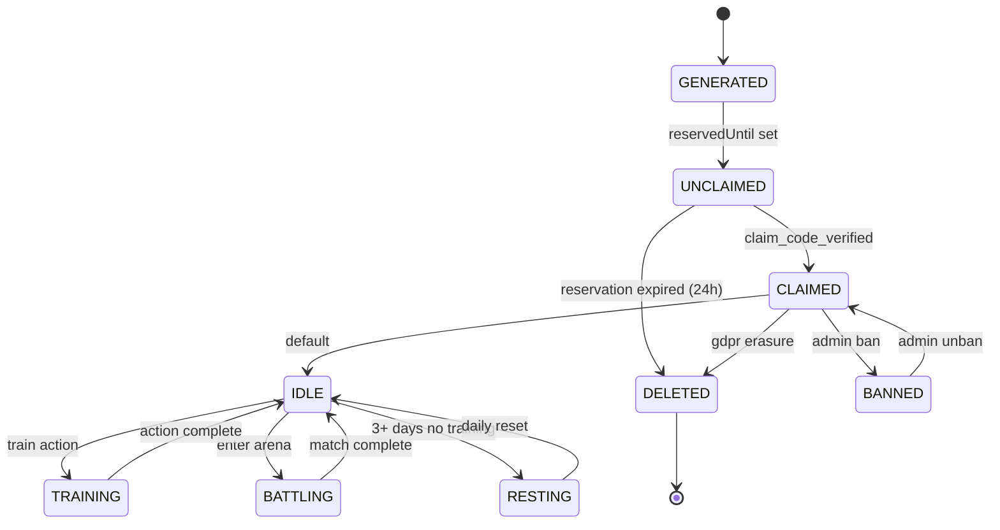

# State Machine Diagram — Pet Lifecycle

寵物從生成到刪除的完整生命週期：GENERATED → UNCLAIMED → CLAIMED（IDLE / TRAINING / BATTLING / RESTING 四個子狀態） → DELETED。CLAIMED 與 BANNED 之間可由 Admin 雙向切換；任意時點均可由 GDPR Erasure 直接進入 DELETED。

> 狀態轉換 label 不含 ` `，符合 QG-UML-04（避免 Safari/Firefox 破圖）。
