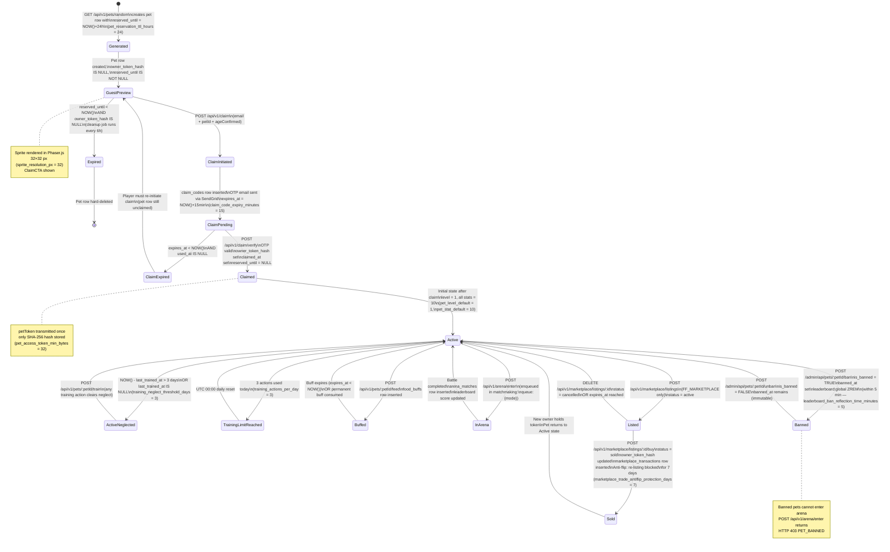

# State Machine — Pet Lifecycle

## Overview

A pet in pixel-pet-arena moves through a defined lifecycle from procedural generation to an active
claimed state, with side-branches for neglect, banning, and (Phase 3) marketplace listing. The
identity layer is entirely token-based — no user account exists. All state transitions are driven
by application events: claim, train, feed, ban, and marketplace actions.

Key lifecycle constants:
- Guest preview reservation window: 24 hours (`pet_reservation_ttl_hours = 24`)
- Neglect threshold: 3 days without training (`training_neglect_threshold_days = 3`)
- Ban reflection on leaderboard: within 5 minutes (`leaderboard_ban_reflection_time_minutes = 5`)
- Marketplace anti-flip window: 7 days (`marketplace_trade_antiflip_protection_days = 7`)

## Diagram

## State Descriptions

| State | `owner_token_hash` | `is_banned` | `reserved_until` | Description |
|---|---|---|---|---|
| Generated / GuestPreview | NULL | FALSE | future timestamp | Pet just created; no owner; visible for 24 h |
| Expired | NULL | FALSE | past timestamp | Cleaned up by background job every 6 h |
| ClaimPending | NULL | FALSE | future timestamp | OTP sent; awaiting code entry (15 min window) |
| Active | set | FALSE | NULL | Normal state; all features available |
| ActiveNeglected | set | FALSE | NULL | No training for > 3 days; visual neglect overlay |
| TrainingLimitReached | set | FALSE | NULL | 3 daily actions exhausted; resets at UTC 00:00 |
| Buffed | set | FALSE | NULL | Active food buff modifying arena stat |
| InArena | set | FALSE | NULL | Matchmaking or battle in progress |
| Banned | set | TRUE | NULL | Blocked from arena; removed from leaderboard |
| Listed | set | FALSE | NULL | Active marketplace listing (Phase 3) |
| Sold | updated | FALSE | NULL | Ownership transferred to buyer |

## Notes

- The `ActiveNeglected` state is a **visual sub-state** of `Active`; it does not block any action.
  Training, arena entry, and feeding all remain available to neglected pets.
- `banned_at` is immutable after ban — it is not reset if the pet is subsequently unbanned
  (admin audit trail requirement).
- `ClaimExpired` is a transient state: no data is deleted on OTP expiry, only the claim code
  record becomes invalid. The pet remains in `GuestPreview` and the player can re-initiate claim.
- Claim code records are purged 72 hours after creation or first use, whichever is later
  (`claim_token_cleanup_ttl_hours = 72`).
