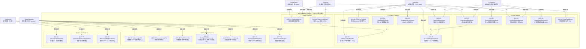

# Use Case Diagram — pixel-pet-arena

> 來源：EDD §3.8 Use Case Diagram, PRD §4 Scope, PRD §3.2 Persona Cards

```mermaid
flowchart TD
    GuestPlayer["GuestPlayer\n訪客玩家（無 token）"]
    PetOwner["PetOwner\n寵物擁有者（URL token）"]
    Competitor["Competitor\n競技玩家（有訓練記錄）"]
    Collector["Collector\n收藏者（關注稀有度）"]
    Admin["AdminOperator\n管理員（TOTP session）"]
    SystemJob["SystemJob\n定時任務（內部）"]

    subgraph PPA ["pixel-pet-arena Platform — BRD §1 系統邊界"]

        subgraph GuestScope ["Guest Features"]
            UC1["((UC-01: ViewRandomPet\n訪客互動隨機寵物))"]
            UC2["((UC-02: ClaimPetViaEmail\n輸入 email 發送 OTP))"]
        end

        subgraph PetOwnerScope ["Pet Owner Features"]
            UC3["((UC-03: VerifyOTPAndGetURL\n驗證 OTP 取得唯一 URL))"]
            UC4["((UC-04: TrainPetDailyActions\n每日 3 次訓練操作))"]
            UC5["((UC-05: FeedPetFoodBuff\n餵食 food buff 提升屬性))"]
            UC6["((UC-06: AccessPetViaUniqueURL\n透過唯一 URL 存取寵物))"]
            UC10["((UC-10: ViewBattleRecords\n查看 20 筆對戰記錄))"]
            UC13["((UC-13: RequestGDPRErasure\nGDPR 刪除請求))"]
        end

        subgraph ArenaScope ["Arena Features"]
            UC7["((UC-07: EnterArenaRaceMode\n進入競速模式對戰))"]
            UC8["((UC-08: EnterArenaSumoMode\n進入相撲模式對戰 P1))"]
            UC9["((UC-09: ViewGlobalLeaderboard\n查看全球排行榜前100))"]
            UC11["((UC-11: ShareBattleRecordURL\n分享對戰記錄公開 URL))"]
            UC12["((UC-12: ViewRarityScore\n查看稀有度分數 P1))"]
        end

        subgraph AdminScope ["Admin Portal Features"]
            UC14["((UC-14: AdminLogin2FA\n管理員 TOTP 雙因素登入))"]
            UC15["((UC-15: BanSuspiciousPet\n封禁異常寵物))"]
            UC16["((UC-16: TuneRateLimits\n調整競技場速率限制))"]
            UC17["((UC-17: ConfigGameEconomy\n設定食物 buff 倍率 + 競技成本))"]
            UC18["((UC-18: ReviewAuditLogs\n查看操作審計日誌))"]
            UC19["((UC-19: ManageGDPRRequests\n處理 GDPR 刪除請求))"]
            UC20["((UC-20: ViewAdminDashboard\n查看管理儀表板))"]
        end

        subgraph SystemScope ["System Job Features"]
            UC21["((UC-21: CleanupExpiredClaims\n清理 24h 未認領寵物))"]
            UC22["((UC-22: UpdateLeaderboardSnapshots\n更新排行榜快照))"]
            UC23["((UC-23: ProcessGDPREmailHash\n處理 GDPR email 雜湊化))"]
        end
    end

    GuestPlayer -- 直接使用 --> UC1
    GuestPlayer -- 直接使用 --> UC2

    PetOwner -- 直接使用 --> UC3
    PetOwner -- 直接使用 --> UC4
    PetOwner -- 直接使用 --> UC5
    PetOwner -- 直接使用 --> UC6
    PetOwner -- 直接使用 --> UC10
    PetOwner -- 直接使用 --> UC13
    PetOwner -- <<extend>> --> UC7
    PetOwner -- <<extend>> --> UC9

    Competitor -- 直接使用 --> UC7
    Competitor -- 直接使用 --> UC8
    Competitor -- 直接使用 --> UC9
    Competitor -- 直接使用 --> UC11
    Competitor -- <<include>> --> UC4

    Collector -- 直接使用 --> UC12
    Collector -- 直接使用 --> UC1
    Collector -- <<extend>> --> UC2

    Admin -- 直接使用 --> UC14
    Admin -- 直接使用 --> UC15
    Admin -- 直接使用 --> UC16
    Admin -- 直接使用 --> UC17
    Admin -- 直接使用 --> UC18
    Admin -- 直接使用 --> UC19
    Admin -- 直接使用 --> UC20

    SystemJob -- 直接使用 --> UC21
    SystemJob -- 直接使用 --> UC22
    SystemJob -- 直接使用 --> UC23

    UC2 -- <<include>> --> UC3
    UC7 -- <<include>> --> UC6
    UC4 -- <<include>> --> UC6
```
