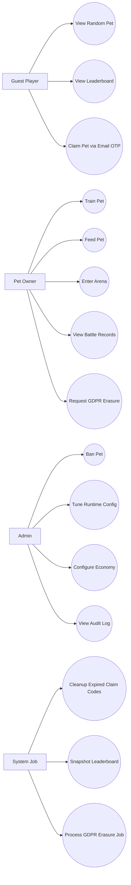

# Use Case Diagram

本圖呈現 Pet Battle Arena 系統四類 actor（Guest / Owner / Admin / System Job）與 15 個主要使用案例之間的互動。Guest 可瀏覽寵物與排行榜並啟動領養流程；Owner 可訓練、餵食、進入競技場、查看戰績、申請 GDPR 抹除；Admin 負責 Ban / Config / Audit 三大管理面；System Job 自動處理過期清理、排行榜快照、GDPR 抹除。

> Actor 數量 ≥ 4，符合 QG-UML-07。
